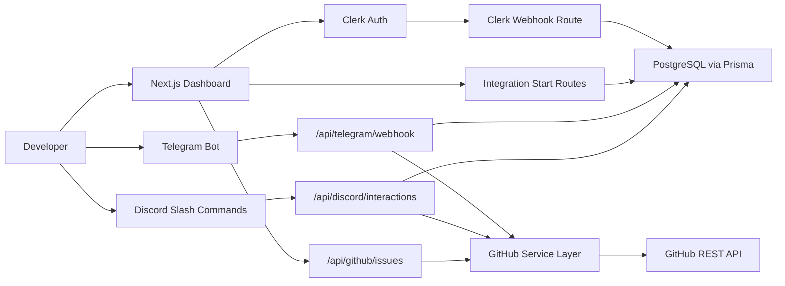
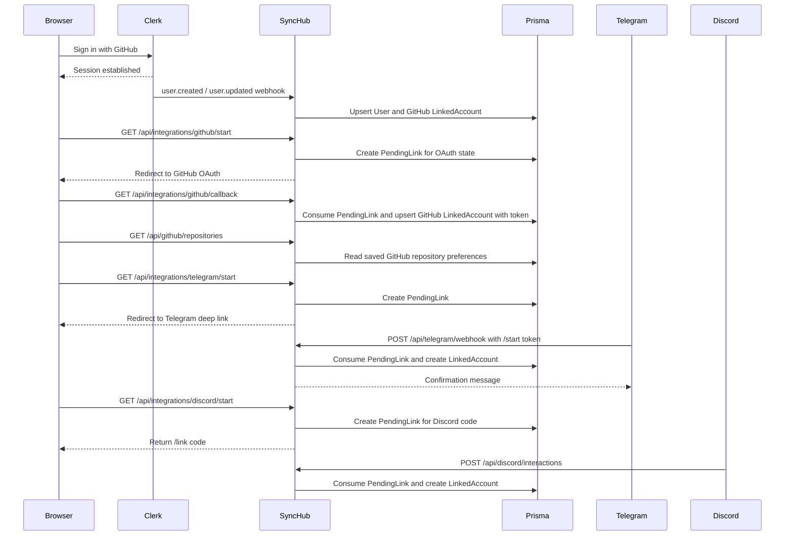

# SyncHub Architecture

## System Overview

SyncHub is a chat-first GitHub issue management tool built on top of a single Next.js application. The web app, API routes, and integration handlers live in the same deployment unit so the operational model stays simple for a solo developer.

Primary system responsibilities:

- Authenticate users with Clerk
- Mirror Clerk users into Prisma using `clerkUserId`
- Link Telegram and Discord identities to the same internal user record
- List accessible GitHub repositories and persist a default repository choice
- Centralize GitHub issue operations behind a reusable service layer
- Expose a lightweight dashboard for configuration and monitoring

## Product Overview

The product focuses on one high-value workflow: letting authenticated developers manage GitHub issues from chat without maintaining separate credentials for every platform. Clerk handles browser authentication, Prisma stores normalized integration data, and platform-specific handlers translate chat actions into shared issue-management services.

## Architecture Diagram



## Data Model

### User

- Internal application identity
- Uses `clerkUserId` as the durable external reference
- Owns `LinkedAccount`, `PendingLink`, and `Reminder` records

### LinkedAccount

- Stores provider-specific identity and optional tokens
- Supports `GITHUB`, `TELEGRAM`, and `DISCORD`
- Keeps provider data out of the core user table

### PendingLink

- Stores single-use, expiring tokens for Telegram and Discord linking
- Prevents direct trust in chat-provided identifiers
- Enables a web-initiated, bot-confirmed connection flow

### Reminder

- Persists follow-up notifications by repository, issue number, and schedule
- Tracks lifecycle state with `ReminderStatus`

## Integration Flows

### Clerk and GitHub Identity Sync

1. User signs in with Clerk.
2. GitHub is enabled as a Clerk social provider.
3. Clerk sends `user.created` and `user.updated` webhooks.
4. SyncHub upserts the internal `User`.
5. GitHub external account metadata is mirrored into `LinkedAccount`.

Trade-off:
This keeps authentication simple, but it is intentionally treated as identity, not repository authorization.

### GitHub OAuth for Issue Actions

1. Signed-in user clicks `Authorize GitHub access`.
2. SyncHub creates a short-lived `PendingLink` token for the OAuth `state`.
3. The user is redirected to GitHub's OAuth consent screen.
4. GitHub redirects back to `/api/integrations/github/callback`.
5. SyncHub validates and consumes the `state` token.
6. SyncHub exchanges the authorization `code` for an access token.
7. SyncHub fetches the GitHub user profile and stores the token on `LinkedAccount`.

Trade-off:
This adds one extra integration step after sign-in, but it makes the permission boundary explicit and gives SyncHub a token intended for issue-management API calls.

### Repository Selection Flow

1. SyncHub uses the GitHub OAuth token to list accessible repositories.
2. The user chooses a repository in the dashboard.
3. SyncHub stores the default repository in GitHub linked-account metadata.
4. Issue listing and creation can then fall back to that saved repository when repo context is not explicitly provided.

### Telegram Linking Flow

1. Signed-in user clicks `Connect Telegram`.
2. SyncHub creates a single-use `PendingLink` token.
3. The user is redirected to `https://t.me/<BOT_USERNAME>?start=<TOKEN>`.
4. Telegram sends `/start <TOKEN>` to the webhook route.
5. SyncHub validates and consumes the token.
6. SyncHub upserts a `LinkedAccount` for `TELEGRAM`.
7. SyncHub sends a confirmation message and exposes `/help`, `/whoami`, and `/status` for follow-up verification.

### Discord Linking Flow

1. Signed-in user clicks `Connect Discord`.
2. SyncHub creates a single-use `PendingLink` token.
3. The dashboard returns instructions to run `/link <CODE>`.
4. SyncHub registers Discord application commands and verifies interaction signatures.
5. Discord sends the slash-command interaction to SyncHub.
6. SyncHub validates and consumes the code.
7. SyncHub upserts a `LinkedAccount` for `DISCORD`.
8. Discord users can then run `/whoami` and `/status` for verification.

Future enhancement:
Add Discord OAuth2 `identify` support for friendlier user onboarding and better token management.

### Discord Developer Portal Setup

SyncHub's MVP Discord integration depends on a bot application plus verified interaction webhooks.

1. Create a Discord application in the Discord Developer Portal.
2. In `General Information`, collect:
- `Application ID` for `DISCORD_APPLICATION_ID`
- `Application ID` again for `DISCORD_CLIENT_ID`
- `Public Key` for `DISCORD_PUBLIC_KEY`
3. In `Bot`, create the bot user and copy its token into `DISCORD_BOT_TOKEN`.
4. In `Installation`, enable these `Guild Install Scopes`:
- `bot`
- `applications.commands`
5. In `Installation`, enable these initial `Bot Permissions`:
- `Send Messages`
- `Use Slash Commands`
6. Install the bot into a test server using the generated install link.
7. In `General Information`, set the `Interactions Endpoint URL` to:

```text
https://YOUR-PUBLIC-URL/api/discord/interactions
```

8. Use SyncHub to register `/link`, `/whoami`, and `/status`.
9. Start the link flow from the dashboard and run `/link <CODE>` inside Discord.

## Data Flow



## Folder Structure

```text
app/
  (dashboard)/
    dashboard/page.tsx
    integrations/page.tsx
    issues/page.tsx
    reminders/page.tsx
    settings/page.tsx
  api/
    discord/interactions/route.ts
    github/issues/route.ts
    integrations/github/callback/route.ts
    integrations/github/start/route.ts
    integrations/discord/commands/register/route.ts
    integrations/discord/start/route.ts
    integrations/telegram/start/route.ts
    telegram/webhook/route.ts
    webhooks/clerk/route.ts
components/
  dashboard/
  ui/
lib/
  clerk.ts
  discord/
  github/
  services/
    telegram-service.ts
  telegram/
  validators/
prisma/
  schema.prisma
```

## Design Decisions

### Next.js as the only backend runtime

Reason:
The user explicitly wanted to avoid introducing Express. Route handlers are enough for Clerk webhooks, Telegram webhooks, Discord interactions, and GitHub API orchestration at this scale.

Trade-off:
Long-running jobs and high-volume webhook processing may eventually justify a worker or queue, but not in the MVP.

### Clerk as the authentication source of truth

Reason:
Clerk removes the need to build custom session, OAuth, and identity-management flows.

Trade-off:
Clerk gives SyncHub a strong app-auth story, but GitHub API permissions are managed through a dedicated OAuth flow so token scope and consent stay explicit.

### Normalized external identities

Reason:
`LinkedAccount` allows GitHub, Telegram, and Discord to evolve independently without bloating the core `User` model.

Trade-off:
A little more relational complexity, but much better long-term maintainability.

### Single-use linking tokens

Reason:
Telegram and Discord chat surfaces should never be trusted to self-assert ownership of a web account.

Trade-off:
Users need one extra linking step, but the security model is much stronger.

## Scaling Considerations

- Start with direct route-handler processing for Telegram and Discord webhooks.
- Add idempotency keys or replay protection as webhook volume increases.
- Introduce scheduled jobs for reminders before adding a full queue.
- Add Redis or another queue only when retries, bursts, or latency require it.
- Separate read models for reporting only when the dashboard grows beyond operational monitoring.

## Phase Plan

### Phase 0: Project Setup

- Goals: configure Clerk, Prisma, env vars, and UI baseline
- Tasks: finalize schema, env docs, route shell, dashboard shell
- Deliverables: working project foundation
- Out of scope: production-grade background jobs

### Phase 1: User and GitHub Authentication

- Goals: sign in with Clerk, sync GitHub identity, and authorize GitHub API access
- Tasks: configure Clerk GitHub social login, handle Clerk webhooks, persist GitHub metadata, implement GitHub OAuth callback flow
- Deliverables: internal user sync, GitHub linked-account persistence, and stored GitHub access tokens for issue actions
- Out of scope: advanced GitHub App installation flow

### Phase 2: Telegram Integration

- Goals: support secure Telegram account linking
- Tasks: issue tokens, redirect to deep links, validate webhook payloads, link chat IDs, and send basic command responses
- Deliverables: Telegram linking, bot intake scaffold, and operator verification commands
- Out of scope: rich bot conversations

### Phase 3: Discord Integration

- Goals: support MVP Discord linking
- Tasks: issue one-time codes, register commands, verify signatures, parse `/link`, `/whoami`, and `/status`, and link user identities
- Deliverables: Discord interaction scaffold with operational verification
- Out of scope: OAuth2 `identify`

### Phase 4: GitHub Issue Management

- Goals: execute issue actions through shared services
- Tasks: list repositories, save a default repository, list issues, create issues, add comments, labels, and assignees, close/reopen issues
- Deliverables: reusable GitHub issue module plus repo-selection workflow
- Out of scope: webhook-driven real-time sync

### Phase 5: Web Dashboard

- Goals: give operators visibility and control
- Tasks: integrations page, issue views, settings, reminders UI
- Deliverables: management dashboard
- Out of scope: full analytics suite

### Phase 6: Reminders and Automation

- Goals: schedule follow-ups
- Tasks: create reminder flows, schedule notifications, track statuses
- Deliverables: reminder delivery foundation
- Out of scope: advanced escalation policies

### Phase 7: GitHub Webhooks

- Goals: sync issue state in real time
- Tasks: receive webhook events, validate signatures, reconcile changes
- Deliverables: GitHub event ingestion
- Out of scope: event streaming architecture

### Phase 8: AI Enhancements

- Goals: improve triage and summarization
- Tasks: add Gemini-powered issue draft generation, issue summaries, suggested labels during issue creation, and digest generation
- Deliverables: optional AI-assisted workflows embedded directly into the dashboard
- Out of scope: autonomous issue handling

### Phase 9: Deployment and CI/CD

- Goals: production deployment and release confidence
- Tasks: Docker polish, Vercel deployment, GitHub Actions, secret management
- Deliverables: repeatable deployment pipeline
- Out of scope: multi-region runtime

## Suggested Next Steps

1. Create the first Prisma migration from the new schema.
2. Configure Clerk GitHub social login and webhook delivery.
3. Register the Telegram bot webhook and Discord application commands.
4. Decide whether GitHub issue actions will use Clerk-managed GitHub tokens or a dedicated GitHub OAuth/App flow.
5. Add real dashboard data fetching once environment variables and external services are configured.
